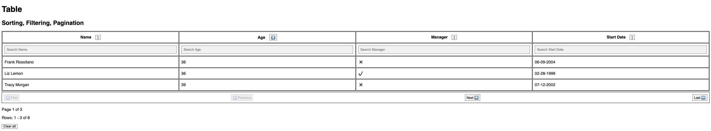

# Front End Tables: Sorting, Filtering, and Pagination

In this app I create an example of React Table App with zero library

# PREREQUISITES

    Knowledge of JavaScript, React

# GOALS

Make a table in React that implements:

1. Pagination
1. Sorting : for strings, Booleans, numbers, and dates (case-insensitive)
1. Filtering : for strings, Booleans, numbers, and dates (case-insensitive)

🚀 Technologies

1. React
2. TypeScript

# `screenShot`

Made with ♥ by DIALLO MAMADOU SAMBA 👋🏻
